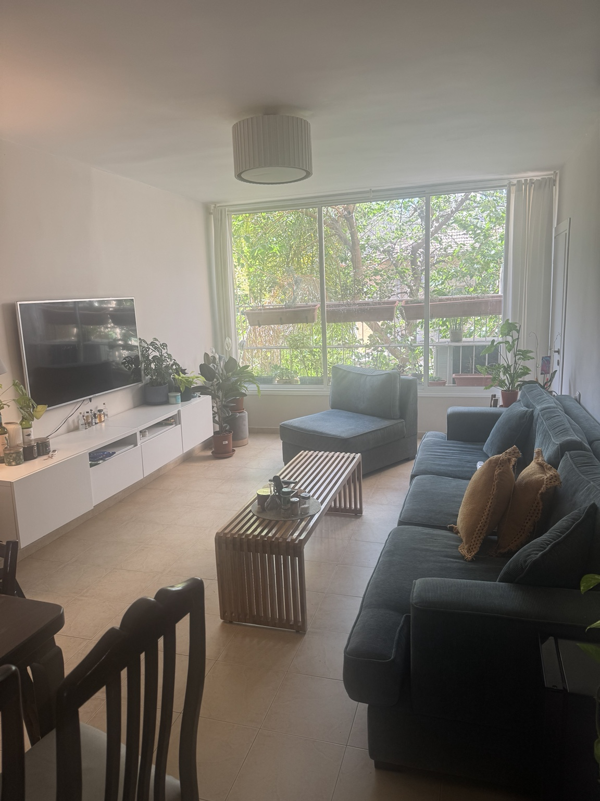
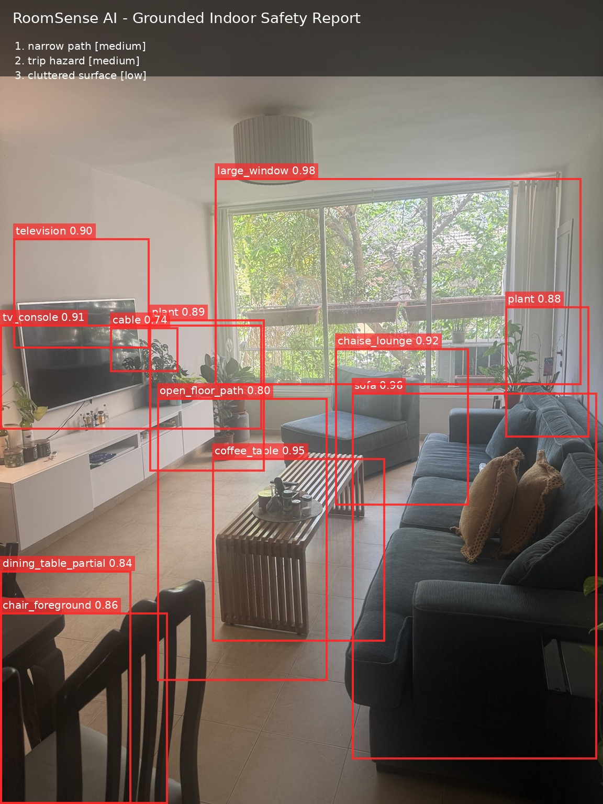

# RoomSense AI

**End-to-end multimodal indoor safety and layout inspector from real room images.**

RoomSense AI analyzes a room photo, detects major indoor objects, reasons about spatial layout, flags safety/accessibility issues, and produces an annotated image plus a structured JSON report.

This repository is designed as a practical AI Engineer portfolio project: it contains a runnable demo, API, Streamlit UI, evaluation scripts, Docker setup, and both a deterministic demo detector and a real open-vocabulary detector backend.

> The current repository includes one real living-room image and three deterministic image variants so the demo runs immediately after cloning. The default detector is annotation-backed for reproducibility. For arbitrary room images, run the Grounding DINO backend with `--detector grounding-dino`.

---

## Demo

### Input image



### RoomSense output overlay



### Depth prior


### Example report

```json
{
  "room_type": "living room",
  "risks": [
    {
      "type": "narrow_path",
      "severity": "medium",
      "grounded_objects": ["sofa", "coffee_table"],
      "recommendation": "Move the coffee table slightly toward the room center or away from the sofa to improve walking clearance."
    },
    {
      "type": "trip_hazard",
      "severity": "medium",
      "grounded_objects": ["cable", "tv_console"],
      "recommendation": "Route the cable behind the TV console or attach it along the wall."
    }
  ],
  "overall_score": 61.0
}
```

---

## What the system does

```text
Room image
  -> object detection / annotation-backed demo detector or Grounding DINO
  -> depth prior
  -> spatial rule engine
  -> grounded natural-language reasoning
  -> annotated image + depth image + JSON report
  -> evaluation metrics
```

Detected objects in the bundled demo include:

- sofa
- chaise lounge
- coffee table
- TV console
- television
- large window
- plants
- dining-table region
- foreground chair
- cable
- open floor path

Detected risks include:

- narrow walking path
- visible cable/trip hazard
- cluttered surface
- positive layout signal: plants near natural light

---

## Repository structure

```text
roomsense-ai/
├── app/                         # Streamlit demo
├── api/                         # FastAPI backend
├── src/
│   ├── models/                  # Detector, depth, reasoning backends
│   ├── reasoning/               # Spatial rules and risk scoring
│   ├── visualization/           # Overlay generation
│   └── utils/
├── scripts/                     # Inference and demo export scripts
├── eval/                        # Evaluation scripts
├── configs/                     # Object prompts and risk rules
├── data/
│   ├── demo_images/             # Real demo image + variants
│   └── annotations/             # Demo annotations
└── outputs/
    ├── examples/                # Generated overlays/reports
    └── reports/                 # Metric outputs
```

---

## Quickstart

```bash
pip install -r requirements.txt
```

Run inference on the bundled room image:

```bash
python scripts/run_inference.py \
  --image data/demo_images/living_room_01.jpg \
  --output_dir outputs/examples
```

Generate outputs for all demo images:

```bash
python scripts/export_demo_results.py
```

Run the Streamlit UI:

```bash
streamlit run app/streamlit_app.py
```

Run the API:

```bash
uvicorn api.main:app --reload
```

Docker:

```bash
docker compose up --build
```

---

## Real detector backend: Grounding DINO

RoomSense AI now includes a full open-vocabulary Grounding DINO detector in `src/models/detector.py`.

Use the default annotation-backed detector when you want a fast, reproducible smoke test:

```bash
python scripts/run_inference.py \
  --image data/demo_images/living_room_01.jpg \
  --detector annotation \
  --output_dir outputs/examples
```

Use Grounding DINO when you want to analyze arbitrary room images:

```bash
pip install -r requirements-grounding.txt

python scripts/run_inference.py \
  --image data/demo_images/living_room_01.jpg \
  --detector grounding-dino \
  --box_threshold 0.25 \
  --text_threshold 0.20 \
  --output_dir outputs/grounding_dino
```

You can also use the convenience wrapper:

```bash
python scripts/run_grounding_dino.py \
  --image data/demo_images/living_room_01.jpg \
  --output_dir outputs/grounding_dino
```

The detector uses the object vocabulary in `configs/object_prompts.yaml`. Add new room-specific objects there, for example `baby gate`, `power outlet`, `mirror`, `bookshelf`, or `laundry basket`.

Recommended GPU command:

```bash
python scripts/run_inference.py \
  --image data/demo_images/living_room_01.jpg \
  --detector grounding-dino \
  --device cuda \
  --model_id IDEA-Research/grounding-dino-base \
  --output_dir outputs/grounding_dino
```

If GPU memory is limited, try a smaller model ID supported by Hugging Face, lower the number of prompt classes, or increase the box threshold to reduce noisy detections.

---

## Evaluation

The repo includes evaluation scripts for the demo set:

```bash
python eval/evaluate_detection.py
python eval/evaluate_risk_classification.py
python eval/evaluate_hallucination.py
python eval/evaluate_latency.py
```

Current smoke-test results over the checked-in annotated demo set:

| Evaluation | Metric | Result |
|---|---:|---:|
| Detection smoke test | F1 @ IoU 0.5 | 1.000 |
| Risk-label smoke test | F1 | 1.000 |
| Grounding check | Grounded-claim rate | 1.000 |
| Runtime | Avg latency / image | ~0.22 sec |

These numbers are **not claimed as a real benchmark** because the default detector reads the bundled annotations. They verify that the project pipeline, data format, risk logic, visualization, and evaluation code work end to end.

For a real benchmark, add 50-100 manually annotated room images and replace the annotation-backed detector with a model backend.


## Design principle

RoomSense AI does not just describe a room. It tries to make **grounded claims**:

```text
Bad: "This room may be unsafe."
Good: "A visible cable near the TV console may create a trip hazard."
```

Every risk item contains `grounded_objects`, which allows the evaluation script to check whether the recommendation is tied to detected visual evidence.

---

## Disclaimer

RoomSense AI is an assistive visual-analysis tool. It is not a professional safety inspection replacement.
